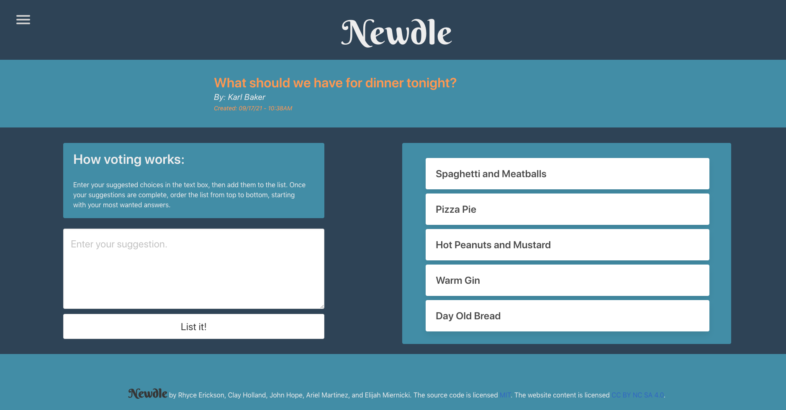

<h1 align="center">BORN Project 3👋</h1>
  

    
    
    
    

    
    
    
    

## Description

* AS A…   
Social person with opinionated friends

* I WANT…   
An app to consolidate ideas to vote upon anonymously

* SO THAT…  
Decisions can be made smoothly and friendships can stay preserved

## Technologies Used
* MongoDB, Express.js, React.js, Node.js (MERN)
* Apollo Server
* GraphQL
* Bulma CSS

## Link to deployed app
https://born001.herokuapp.com/

💻 Below is a screenshot of the application:
  

## License

  
